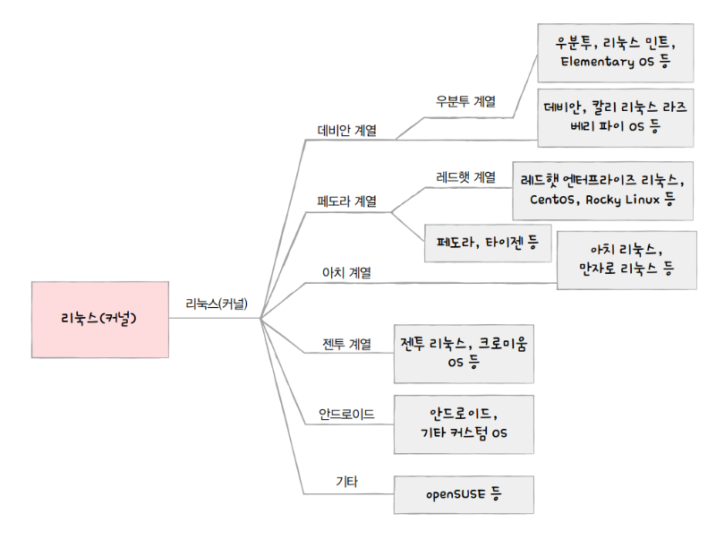

> **리눅스마스터** 1급 1차 · 시험일 2026-09-12

## 오늘 범위

2023년 3월 11일 기출 정리

[최강 자격증 기출](https://www.comcbt.com/xe/r1/6668022)

일단 기출 내용을 보고 필요한 내용들을 기록해보자.

## 정리

### 1과목

1969년 AT&T 사의 벨 연구소의 켄 톰슨 및 데니스 리치에 의해 **유닉스**가 개발되었다.  
1991년 핀란드의 헬싱키 대학생이었던 리누스 토발즈는 **리눅스 커널**을 개발했다.  
그는 네덜란드의 **앤드루 타넨바움**교수가 만든 교육용 미니 유닉스인 **미닉스(MINIX)**를 참고하여 유닉스를 개발했다.  
리처드 스톨만은 자유 소프트웨어 재단을 설립하고, **GNU 프로젝트**를 진행했다.

**파이프**(|) : 특정 프로세스의 표준 출력을 다른 프로세스의 표준 입력으로 지정할 수 있는 대표적인 프로세스 간 통신(IPC) 방식  
**리다이렉션**(>,<,>>) : 프로세스의 표준 입출력을 파일, 화면, 장치 등에서 출력할 수 있돌고 입출력을 재지정할 수 있는 매커니즘  
**가상 콘솔** : 리눅스 운영체제에서 사용할 수 있는 가상의 모니터.

오픈소스 라이브러리 : 코드를 어디까지 마음대로 써도 되는지를 정해놓은 규칙  
**GPL** (강함) : 조금이라도 쓰면 전체를 GPL 라이선스로 하여 소스 코드를 공개해야함. 변경사항 명시.  
ex) 리눅스 커널, Git, 파이어폭스(2.0), 마리아DB  
**LGPL** (중간) : 라이브러리로만 쓰면 공개 X. 단순 링크 이상으로 쓰면 공개 O. 변경사항 명시.  
**MPL** (중간) : 수정한 파일만 MPL로 공개. 새로 만든 파일은 공개 X. 특허 사실 LEGAL 파일 기록. 실행파일은 독점 배포 가능  
ex) 파이어폭스(1.1)  
**Apache** (약함) : 소스 코드 공개 의무 X. 변경사항 명시. 2차 라이선스 가능. 특허 조항 있음(BSD보다 완화)  
ex) Hadoop, Tomcat, 안드로이드  
**BSD** (약함) : 저작권·라이선스 명시만 하면 제약 없음  
ex) OpenDV  
**MIT** (약함) : 소스 코드 공개 의무 X. 2차 라이선스 가능  
ex) X 윈도 시스템  

리눅스 배포판을 알아보자.  

**Debian 계열**은 dpkg, apt, apt-get을 사용
Debian : 이 계열의 뿌리(원조)

### 2과목

### 3과목

### 4과목

### 5과목

## 오답노트

범위 왜이렇게 많아

## 참고자료

[리눅스 배포판](https://www.hanbit.co.kr/channel/view.html?cmscode=CMS7512013046)